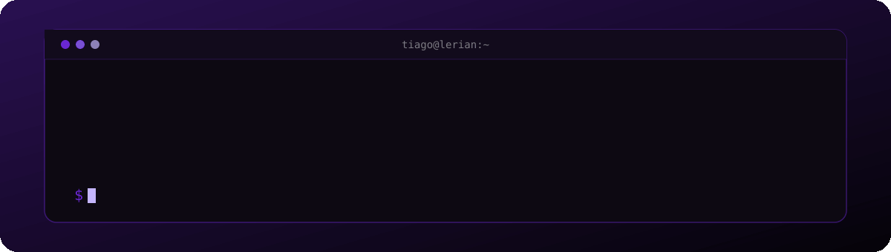
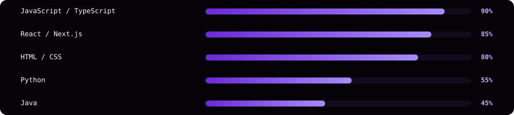

 

  

Sou estudante de **Análise e Desenvolvimento de Sistemas** e **Dev Estagiário na Lerian**, com foco atual em **front-end**, interfaces modernas e evolução constante em desenvolvimento web.

| Atualmente | Foco | Objetivo |
|:---:|:---:|:---:|
| Dev Estagiário · Lerian | Front-end | Criar soluções limpas e funcionais |

 

  

  

 

  

  

  

 

  

 

<i>"A verdadeira arte é só um reflexo dos sentimentos que quem a contempla."</i>

 

© tiagostnz · powered by <a href="https://lerian.studio">lerian</a>

